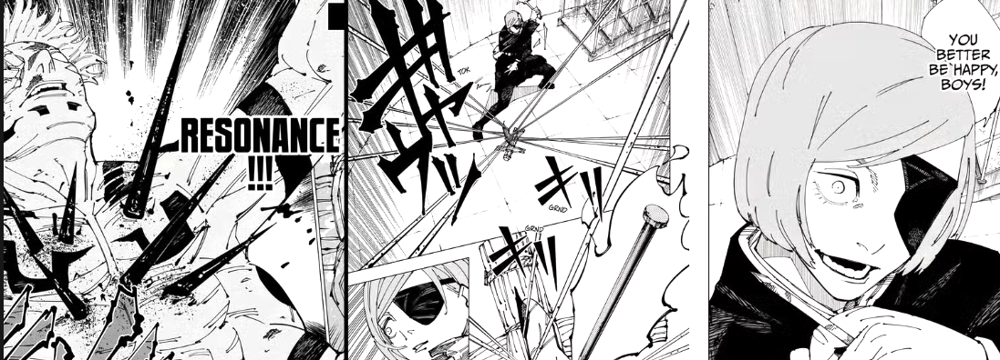

<div align="center">
  
  <h1 align="center">cursed-resonance (共鳴り)</h1>
  <p align="center"><i>Universal Audio & SFX Materialization Domain</i></p>
  
  [](https://python.org)
  [](https://runpod.io)
</div>

---

> *"Resonance." (共鳴り)* — Nobara Kugisaki

**cursed-resonance** is a unified, serverless Audio Engine designed to handle both Sound Effects (SFX) and Music Bed generation. It acts as the Tier 2 fallback layer for the **kamui** pipeline.

Instead of running multiple idle GPU instances for different audio models, `cursed-resonance` runs on a single cheap GPU and dynamically loads either **ControlFoley** (SFX) or **ACE-Step** (Music) into VRAM on-the-fly.

---

## Architecture

1. **The Core**: A lightweight Docker image containing the PyTorch environment.
2. **The Swapper**: When you request a sound effect, the handler pulls `ControlFoley` from your R2 bucket. When you request music, it clears VRAM and loads `ACE-Step`. 
3. **The Delivery**: Generated `.wav` files are uploaded back to R2, and a pre-signed download URL is returned to your pipeline.

---

## The API Payload

Send a simple JSON request to generate either SFX or Music:

**For SFX (ControlFoley):**
```json
{
  "input": {
    "type": "sfx",
    "prompt": "heavy cinematic bass impact",
    "duration": 1.5
  }
}
```

**For Music (ACE-Step):**
```json
{
  "input": {
    "type": "music",
    "prompt": "tense ambient synth loop, fast tempo",
    "duration": 30
  }
}
```

---

## Setup & Deployment

Read the **[SETUP.md](./SETUP.md)** file for a full guide on deploying this endpoint to RunPod via GitHub Container Registry (GHCR) and securely linking your Cloudflare R2 bucket.
